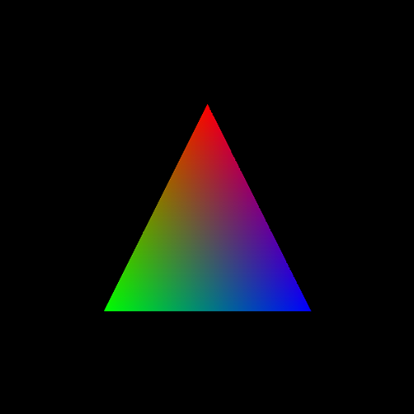
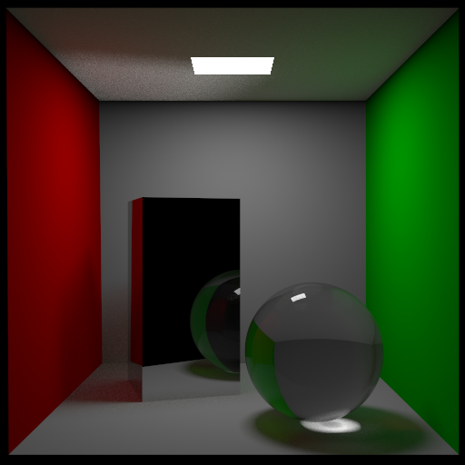
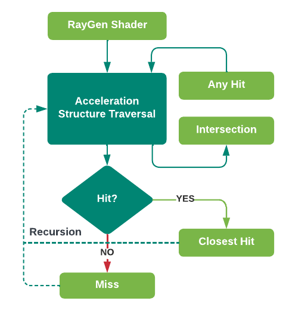

# WebGPU Ray Tracing eXtension
## Introduction
WebGPU Ray Tracing Extension (WebRTX) extends the WebGPU API with ray tracing capabilities. The Javascript programming interface is based on Vulkan's Ray Tracing API and is heavily influenced by the `dawn-ray-tracing` [`spec`](https://github.com/maierfelix/dawn-ray-tracing/blob/master/RT_SPEC.md). On GPU side, you can directly use the five shader stages introduced by the [`GLSL_EXT_ray_tracing`](https://github.com/KhronosGroup/GLSL/blob/master/extensions/ext/GLSL_EXT_ray_tracing.txt) extension for building GLSL shaders.

Unlike the `dawn-ray-tracing` project which requires a new Chromium build for translating WebGPU commands to calls to native backends, WebRTX is not hardware ray tracing and is a pure compute shader implementation. This means WebRTX works as long as your browser supports WebGPU (only tested on Chrome so far).

## Specification
See [types.ts](./src/types.ts). Note that the spec is unstable in current state and might change in future development.

## Examples
* [WebRTX triangle](https://www.github.com/codedhead/webrtx_triangle_example) - ray tracing a triangle



* [shadowray.gl](https://shadowray.gl) ([project](https://www.github.com/codedhead/shadowray)) - a website that allows editing and running WebRTX application in realtime



## How it works


[*recreated based on Khronos' [diagram](https://www.khronos.org/blog/ray-tracing-in-vulkan)*]

The five stage shaders (light green) are provided by users, while the acceleration structure traversal and the (recursive) invocations of user shader functions are implemented by WebRTX's internal compute shader code.

More specifically,
* The core WebRTX compute shader code traverses the bounding volume hierarchy (BVH) for ray-primitive intersection and calls user shader functions by looking up function handles and parameters in the Shader Binding Table.
* The building of BVH happens on host which is then flattened into a buffer for stackless traversal on GPU.
* A WASM GLSL parser ([glsl-lang](https://github.com/vtavernier/glsl-lang)) parses and manipulates user provided shaders, and combine them with WebRTX's internal shader code into a mega compute shader. The manipulation includes e.g. rewriting shader entry function names, rewriting shader variables (like ray payload and ray attribute) for inter-shader communication etc.
* The Typescript library code patches WebGPU API object(s) and internally turns the ray tracing pass into a compute pass with necessary states and GPU resources.
* Because WebGPU does not accept SPIR-V anymore, user provided `GLSL_EXT_ray_tracing` shader codes are compiled to SPIR-V using [glslang.js](https://github.com/kainino0x/glslang.js), then to WGSL using [naga](https://github.com/gfx-rs/naga).

## Development
### Code structure

* `/bvh` - Rust code for building BVH and serializing it to a format suitable for stackless traversal on GPU.
* `/glsl` - Rust code for parsing and manipulating user provided shaders.
* `/naga` - WASM binding for [naga](https://github.com/gfx-rs/naga), based on [wasm-naga](https://github.com/pjoe/wasm-naga).
* `/src` - All other typescript library code.

### Building
Dependencies
* `npm`
* `wasm-pack`
```bash
npm run build
```
